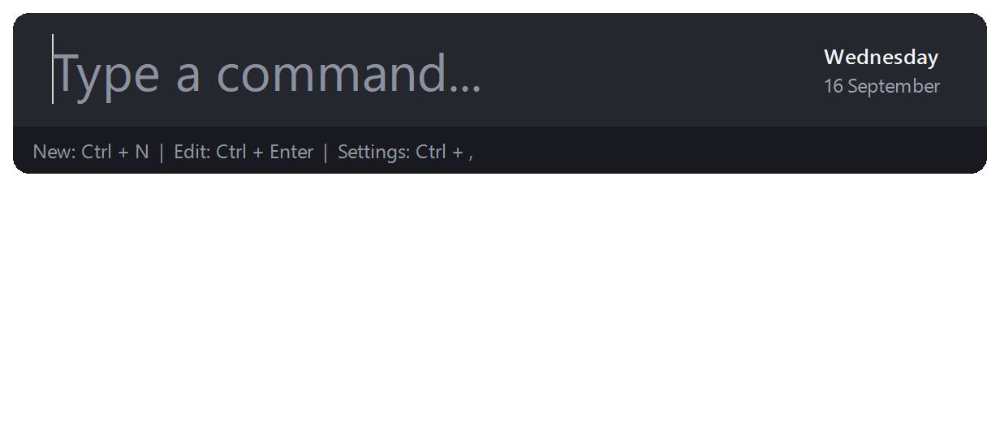
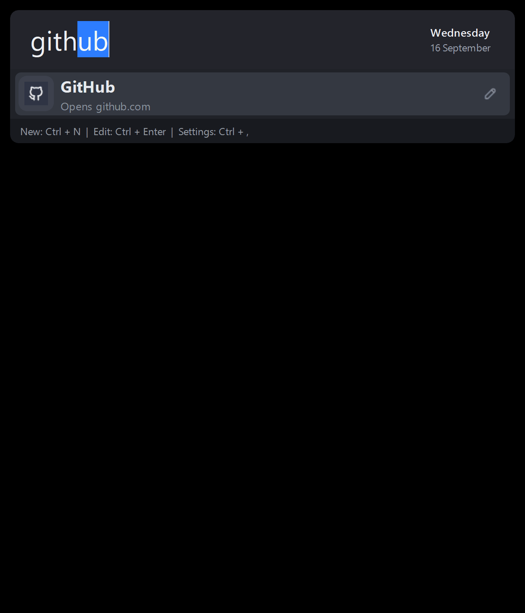
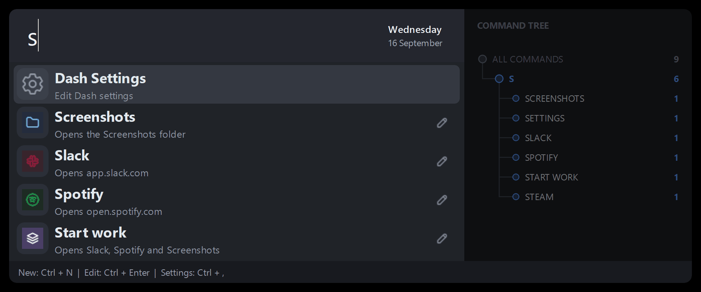

<h1 align="center">
   
</h1>

<p align="center">
   <strong>Dash is a fast, predictable keyboard launcher for Windows.</strong>
</p>

<p align="center">
   Your apps, files, folders and websites are a few letters away, and the same thing opens every time.
</p>

<p align="center">
   <a href="https://github.com/CalemYoung/Dash/releases"></a>
   
   
   <a href="LICENSE"></a>
</p>

---

## Why another launcher

Dash came out of using launchers that index everything on the machine. They
lagged while typing, and now and then the results reordered between one
keystroke and the next, so typing fast and hitting Enter opened the wrong
thing.

Dash does less on purpose:

- **Only your commands.** Nothing is indexed. The list holds what you added,
  so there is nothing in the results you don't care about. A one-off scan can
  import your installed programs as a starting point, but you choose what
  stays.
- **Predictable matching.** Results are prefix matches on names and aliases.
  The same letters always narrow to the same commands, an exact name or alias
  always comes first, and the rest follow a rule you pick (alphabetical or
  most used) rather than a relevance score that shifts as you type.
- **Nothing between you and the command.** No plugins, no web results, no
  file search. Open, type, Enter.

If you want a launcher that searches your files and the web, there are good
ones. Dash is for when you already know what you are going to type.

## Features

- **Instant access:** Open Dash from anywhere with the global `Alt+F` hotkey.
- **Flexible commands:** Launch applications, files, folders, and URLs from one search box.
- **Aliases:** Add the terms you naturally type, so `gh` can open GitHub and `mail` your inbox.
- **Quick calculations:** Evaluate mathematical expressions without opening another app.
- **Command tree:** Optionally show a side panel that maps how each letter you type narrows the matches. Turn it on under Settings.
- **Made to fit:** Customize commands, icons, settings, and startup behavior.

## See Dash in action

### Search and launch

Type a few letters and the name completes inline. Aliases work too, and
calculations can also be done.

<p align="left">
   
</p>

### Manage commands

Press Ctrl+Enter on a result to edit it in place: name, description, type,
target, aliases and icon.

<p align="left">
   
</p>

### Command tree

An optional side panel that shows how each letter you type narrows the
matches. Turn it on under Settings.

<p align="left">
   
</p>

## Install

With winget:

```powershell
winget install dash
```

Or by hand:

1. Download `DashSetup-<version>.exe` from the
   [Releases page](https://github.com/CalemYoung/Dash/releases).
2. Run the installer and choose whether Dash should create a desktop shortcut
    or start when you sign in.
3. Press `Alt+F` to open Dash.

Until you have added a command, opening Dash shows two rows: an offer to
scan your installed programs and common Windows folders and tools, and the
Settings command beneath it. Press Enter on the first to run the scan, or run
it again any time from Settings.

Use the system tray menu to open settings or manage commands. Dash stores your
configuration in `%APPDATA%\Dash`, so upgrades keep your settings and commands.

Starting Dash from the Start Menu or a shortcut opens the search bar, and if
Dash is already running it brings up the existing copy rather than a second
one. Only the start-at-sign-in entry starts Dash silently in the tray; it
passes `--startup` to do so.

Dash checks GitHub for a new release once each time it starts and shows a
single tray notification if there is one. Nothing is installed until you
choose "Install and Restart", at which point the installer is downloaded,
verified against the release's SHA-256 checksum, and run. Turn off "Check for
updates at startup" in Settings to stop the check, or use "Check for
Updates..." in the tray menu at any time.

## Development

Dash requires Windows and Python 3.11 or later. To run it from source:

```powershell
py -3.11 -m venv .venv
.\.venv\Scripts\Activate.ps1
python -m pip install --upgrade pip
python -m pip install -r requirements.txt
python dash.py
```

<details>
<summary><strong>Build the Windows installer</strong></summary>

<br>

Install [Inno Setup 6](https://jrsoftware.org/isinfo.php), then run:

```powershell
.\.venv\Scripts\python.exe build\scripts\build_installer.py
```

The build reads its version from `build/installer/version.txt` and writes the
installer to `dist/DashSetup-<version>.exe`.

</details>

<details>
<summary><strong>Publish a GitHub release</strong></summary>

<br>

Releases are built on GitHub's Windows runner. The workflow compiles the
PyInstaller bundle with Inno Setup, verifies the installer, and attaches it to
the GitHub Release. `build/installer/version.txt` is the only
place the version is stored; the build stamps it into the exe and installer.

1. Update `build/installer/version.txt` to the intended version, such as
   `2.1.0`, and commit it.
2. Create and push a matching version tag:

   ```powershell
   git tag v2.1.0
   git push origin v2.1.0
   ```

3. Wait for the **Release** workflow to complete. The resulting
   `DashSetup-2.1.0.exe` is available under GitHub Releases to share with
   others.

The tag must match `v` plus the version in `build/installer/version.txt`.
Each run also produces a 14-day Actions artifact to help diagnose a failed
release build.

</details>

## License

Dash is licensed under the [MIT License](LICENSE).
