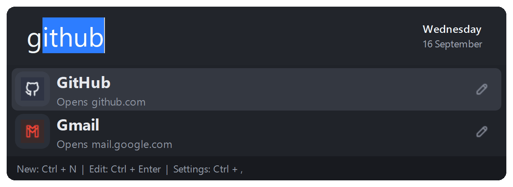
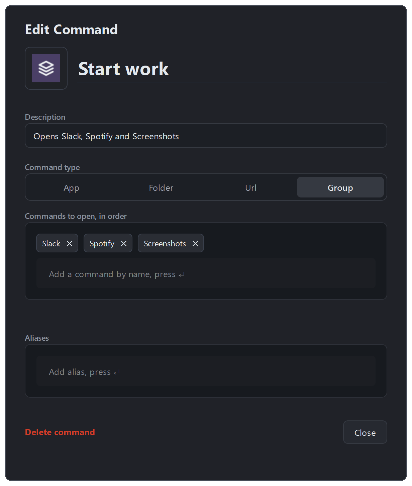

<h1 align="center">
   
</h1>

<p align="center">
   <strong>Dash is a fast, predictable keyboard launcher for Windows.</strong>
</p>

<p align="center">
   Your apps, files, folders and websites are a few letters away, and the same thing opens every time.
</p>

<p align="center">
   <a href="https://github.com/CalemYoung/Dash/releases"></a>
   
   
   <a href="LICENSE"></a>
</p>

---

## Features

- **Instant access:** Open Dash from anywhere with a global hotkey: `Alt+Space` on new installs (earlier versions used `Alt+F`, which upgrades keep). Change it under Settings.
- **Flexible commands:** Launch applications, files, folders, websites, Store apps and Windows Settings pages from one search box, with optional arguments and a start-in folder for apps.
- **Aliases:** Add the terms you naturally type, so `gh` can open GitHub and `mail` your inbox.
- **Site search:** Put `{query}` in a website's address and `gh dash` searches it, while `gh` on its own still opens the site.
- **Groups:** One command that opens several others, in order, so a project's apps, folders and tabs start together.
- **Already open? Switch to it:** Opening an app that is running brings its window forward rather than starting a second copy.
- **Quick calculations:** Work out sums like `12*8`, `200+15%` or `sqrt(2)` where you type; Enter copies the answer.
- **More than open:** Right-click a result (or use the keys below) to run it as administrator, open its folder, copy its path or open a new copy.
- **Add from anywhere:** Copy a file or folder in Explorer and press `Ctrl+V` in Dash, or drop a file, shortcut or link on it, to make it a command. Type something that matches nothing and Dash offers to add it.
- **Icons you pick:** Every command gets one on its own, and you can swap in a library glyph or your own image, recolor it, or go back to the one Dash found.
- **Take it with you:** Export commands to a portable file and import them on another PC, icons and all.
- **Made to fit:** Light, dark or system theme, size, hotkeys, the display Dash opens on, the browser websites use, the web search engine, text sizes, the clock and the update check are all settings.

## Why another launcher?

Dash came out of using launchers that index everything on the machine. They
lagged while typing, and now and then the results reordered between one
keystroke and the next, so typing fast and hitting Enter opened the wrong
thing.

Dash does less on purpose:

- **Only your commands.** Nothing is indexed. The list holds what you added,
  so there is nothing in the results you don't care about. A one-off scan can
  import your installed programs as a starting point, but you choose what
  stays.
- **Predictable matching.** Results are prefix matches on names and aliases,
  followed by names with a later word that starts with what you typed (so
  `code` finds Visual Studio Code). The same letters always narrow to the
  same commands, an exact name or alias always comes first, and the rest
  follow a rule you pick (alphabetical or most used) rather than a relevance
  score that shifts as you type.
- **Nothing between you and the command.** No plugins, no file search, and no
  web results unless you switch them on. Open, type, Enter.

If you want a launcher that searches your files and the web, there are good
ones. Dash is for when you already know what you are going to type.

## See Dash in action

### Search and launch

Type a few letters and the name completes inline. The results are only ever
the commands that still match, so the list shrinks as you type. Aliases work
the same way, and an expression is worked out where you type it.

<p align="left">
   
</p>

### Search a website from the search box

Give a website command an address with `{query}` in it and its name becomes a
keyword: the name on its own opens the site, a space searches it.

<p align="left">
   
</p>

### Edit a command, or build a group

Press Ctrl+Enter on a result to edit it in place: name, description, type,
target, browser, aliases and icon. A group is edited the same way, except its
targets are other commands, and it opens them in the order they are listed.

<p align="left">
   
   
</p>

## Keys

| Key | What it does |
| --- | --- |
| `Alt+Space` | Open Dash from anywhere |
| Type, then `Enter` | Open the selected command |
| `↑` `↓` | Move through the results; the search box completes to the selected one |
| `Tab` | Fill in the selected command's name or alias; a search keyword also gets its space, ready for the search text |
| `Ctrl+Enter` | Edit the selected command |
| `Shift+Enter` | Open a new copy, even if the app is already open |
| `Ctrl+Shift+Enter` | Run the selected app as administrator |
| `Alt+Enter` | Open the folder that holds the selected command |
| Right-click, or the `Menu` key | More actions for the selected result |
| `Ctrl+N` | Add a new command |
| `Ctrl+,` | Open Settings |
| `Esc` | Close Dash |

The hotkey and the three `Ctrl` shortcuts are yours to change under Settings.

## Beyond opening things

- **Nothing matches?** Dash offers to add what you typed as a new command.
  Turn on "Web search unknown commands" in Settings to also offer a web
  search for it, first in the list.
- **Groups carry on.** A target that has been deleted or will not open is
  reported when the group finishes, rather than stopping the ones after it.
- **Switch instead of relaunch.** If an app's window is already open, Dash
  brings it forward rather than starting it again. Turn it off under Settings
  if you would rather always start a fresh copy.
- **Icons.** Every command gets an icon without you doing anything: the app's
  own icon, the site's favicon, or a default for its kind. Click the icon in
  the editor to replace it with one of the 5,000-odd Tabler glyphs or an image
  from disk, and recolor either. "Use default icon" drops yours and goes back
  to the one Dash found.
- **Usage history.** Dash counts how often you open each command so "most used
  first" can order the results. Show the counts, or clear the history, under
  Settings.
- **Move your commands.** Export any selection of commands to a portable file
  and import it elsewhere. Paths under your home folder travel as `~`, and
  custom icons go with them.

## Install

With winget (once the package is listed in the winget catalog):

```powershell
winget install --id CalemYoung.Dash -e
```

Or by hand:

1. Download `DashSetup-<version>.exe` from the
   [Releases page](https://github.com/CalemYoung/Dash/releases).
2. Run the installer and choose whether Dash should create a desktop shortcut
    or start when you sign in.
3. Press `Alt+Space` to open Dash.

Until you have added a command, opening Dash shows two rows: "Find recommended
commands", and the Settings command beneath it. The scan offers your installed
programs and Store apps, common Windows tools, the Windows Settings pages
people actually open, the folders in Explorer's Quick Access and the bookmarks
bar of any browser it finds. It also offers the websites most people want,
Google, YouTube, Gmail, Maps, Wikipedia and the rest, with their search links
already filled in, so `g` opens Google and `g dash` searches it.

They arrive on a tab each, for apps and tools, folders, websites and Windows
Settings, with a filter box, so you can go through them a kind at a time. The
pencil on a row opens it in the editor first, to rename it or change its icon
before it is added. Programs you have opened recently start ticked, and each
comes with short aliases you can edit, so `word` finds Microsoft Word and `vsc`
finds Visual Studio Code. Nothing is added until you choose it, and you can
run the scan again any time from Settings.

To tidy up later, open Settings and choose "Manage Commands..." to see,
edit or delete every command at once.

Settings opens from the launcher: press `Ctrl+,`, or type "settings". The
system tray menu can also open Dash and Settings, and holds the app itself:
the install, config and log folders, the update check, About and Quit. Dash stores your configuration in
`%APPDATA%\Dash`, so upgrades keep your settings and commands.

Starting Dash from the Start Menu or a shortcut opens the search bar, and if
Dash is already running it brings up the existing copy rather than a second
one. Only the start-at-sign-in entry starts Dash silently in the tray; it
passes `--startup` to do so.

Dash checks GitHub for a new release once each time it starts and shows a
single tray notification if there is one. Nothing is installed until you
choose "Install and Restart", at which point the installer is downloaded,
verified against the release's SHA-256 checksum, and run. Turn off "Check updates
at startup" in Settings to stop the check, or use "Check for
Updates..." in the tray menu at any time.

If Dash can't use its hotkey because another app already has it, a tray
notification says so; choose a different key under Settings.

## Privacy

Dash has no telemetry. Your commands, settings and usage counts stay in
`%APPDATA%\Dash`. It goes online only to check for updates, to fetch website
icons, and when you open a website or search the web. Both the update check
and icon downloads can be turned off in Settings. [PRIVACY.md](PRIVACY.md)
lists every request.

## Troubleshooting

Dash keeps a log at `%APPDATA%\Dash\logs\dash.log`; "Open Log Folder" in
the tray menu takes you there. Please attach it when you
[report a bug](https://github.com/CalemYoung/Dash/issues/new/choose). If a
settings or commands file is damaged, Dash starts anyway, keeps the damaged
file beside the original with `.bad` on the end, and tells you.

Security issues: see [SECURITY.md](SECURITY.md). What changed in each
release: see [CHANGELOG.md](CHANGELOG.md).

## Development

Dash requires Windows and Python 3.11 or later. To run it from source:

```powershell
py -3.11 -m venv .venv
.\.venv\Scripts\Activate.ps1
python -m pip install --upgrade pip
python -m pip install -r requirements-dev.txt
python dash.py
```

Run the tests with `python -m pytest`. See [CONTRIBUTING.md](CONTRIBUTING.md)
for more.

<details>
<summary><strong>Build the Windows installer</strong></summary>

<br>

Install [Inno Setup 6](https://jrsoftware.org/isinfo.php), then run:

```powershell
.\.venv\Scripts\python.exe build\scripts\build_installer.py
```

The build reads its version from `build/installer/version.txt` and writes the
installer to `dist/DashSetup-<version>.exe`.

</details>

<details>
<summary><strong>Publish a GitHub release</strong></summary>

<br>

Releases are built on GitHub's Windows runner. The workflow compiles the
PyInstaller bundle with Inno Setup, verifies the installer, and attaches it to
the GitHub Release. `build/installer/version.txt` is the only
place the version is stored; the build stamps it into the exe and installer.

1. Update `build/installer/version.txt` to the intended version, such as
   `2.1.0`, and commit it.
2. Create and push a matching version tag:

   ```powershell
   git tag v2.1.0
   git push origin v2.1.0
   ```

3. Wait for the **Release** workflow to complete. The resulting
   `DashSetup-2.1.0.exe` is available under GitHub Releases to share with
   others.

The tag must match `v` plus the version in `build/installer/version.txt`.
Each run also produces a 14-day Actions artifact to help diagnose a failed
release build.

</details>

## License

Dash is licensed under the [MIT License](LICENSE).
